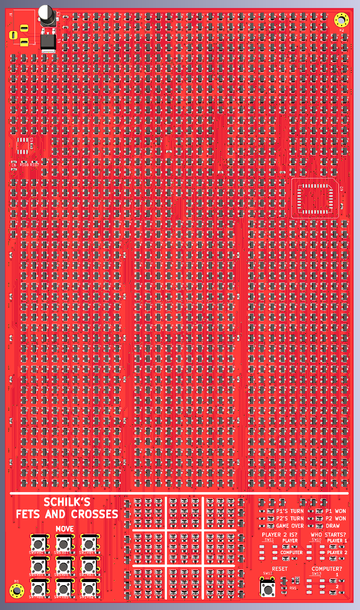

# Fets and Crosses
### Philipp Schilk

An implementation of the classic Tic-Tac-Toe / Knots and Crosses game
built almost completely from discrete transistors.

Why? *Because.*

## Features
- Players vs Player and Player vs Computer
- Win-State and End-State detection
- Enforces game rules (prevents illegal moves)
- Shiny LEDs

## Release & Schematic viewing
See [Github releases](https://wwww.github.com/TheSchilk/Fets_and_Crosses/releases/) for all production files, schematics, etc...

I included a Schematic pdf for archiving purposes, but that is probably the wrong way to learn about
this project. Because the different gates and sub-circuits are each used many times throughout the 
design, the pdf is almost 400 pages long.

It is much  easier to open up the KiCad project itself, which allows for better navigation
of the hierachical schematic.

See [here](https://kicad-pcb.org/download/) for the download.

Open the Project file (KiCad/FetsAndCrosses/FetsAndCrosses.proj) in KiCad, and select the schematic viewer.
Simply double-clicking on a scheet will bring up the schematic for that sub-section.
Use the 'Leave Sheet' button in the top toolbar to get back. 
There you will also find a overview of the schematic project under 'Navigate Schematic Hierarchy'

## Implementation Details

All logic implemented in standard CMOS logic using discrete transistors.

The only exception to this is the Computer-opponent: To reduce complexity to the point of feasibility,
for now, this is implemented with a ROM IC. The optimal move is programmed into each
address corresponding to a valid game state (See Matlab_MemoryGen).

## Overview

**Logisim:**
	Logic Simulation.
	Download LogiSim at [cburch.com](http://www.cburch.com/logisim/).
	
**Matlab_MemoryGen:**
	Matlab code used to generate contents of AI's ROM. 
	Run MemoryGen.m to generate. Run MakeBinaryFile.m / MakeLogiSimROM.m to write generated memory to file

**KiCad:**  
    Full KiCad Project.  
    Gerber files in KiCad/FetsAndCrosses/Gerber.  
    Schematic in KiCad/FetsAndCrosses/
