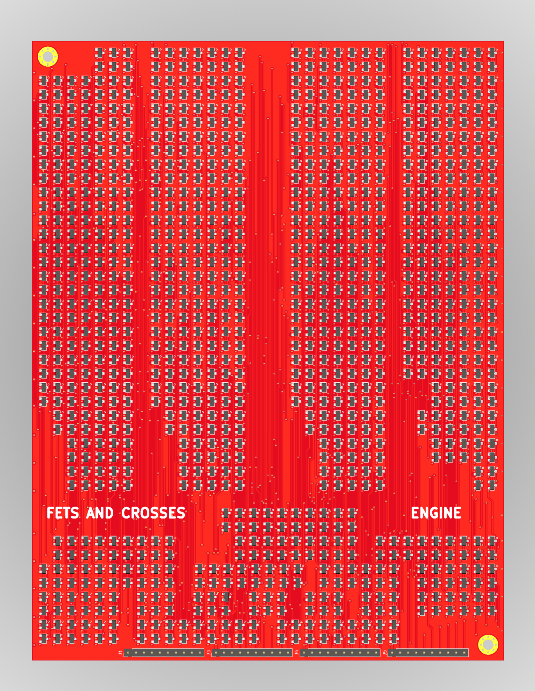
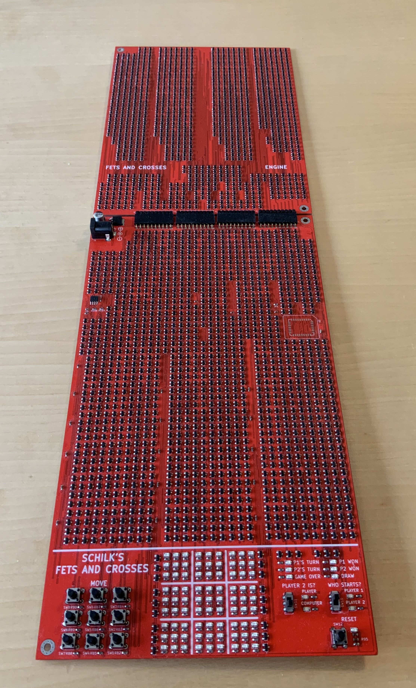

# Fets and Crosses
### Philipp Schilk

An implementation of the classic Tic-Tac-Toe / Knots and Crosses game
built entirely from 2458 discrete transistors.

Why? *Because.*

## Features
- Players vs Player and Player vs Computer with engine fully implemented in transistors.
- Win-State and End-State detection
- Enforces game rules (prevents illegal moves)
- Shiny LEDs

## Release & Schematic viewing
See [Github releases](https://wwww.github.com/TheSchilk/Fets_and_Crosses/releases/) for all production files, schematics, etc...

Although the schematic is included in PDF form, it is recommended to view the schematic in KiCad directly.

## Implementation Details

All logic implemented in standard CMOS logic using discrete transistors.

The engine opponent is also implemented in logic on a seperate PCB, but can be substituted
with a ROM IC on the main IC.

JP1 has to be added when using the ROM IC, and removed when using the engine PCB.

## Overview

**Logisim:**  
	Logic Simulation.
	Download LogiSim at [cburch.com](http://www.cburch.com/logisim/).  
	
**Scripts:**  
	Various python scripts to test different engine designs and generate ROM contents.  

**ROM:**  
	Generated ROM files.  
	
**ECAD:**  
    All KiCad projects and production files.  
    
## Other Links
[Construction Timelapse](https://www.youtube.com/watch?v=Lz2p190qZ2Q)
